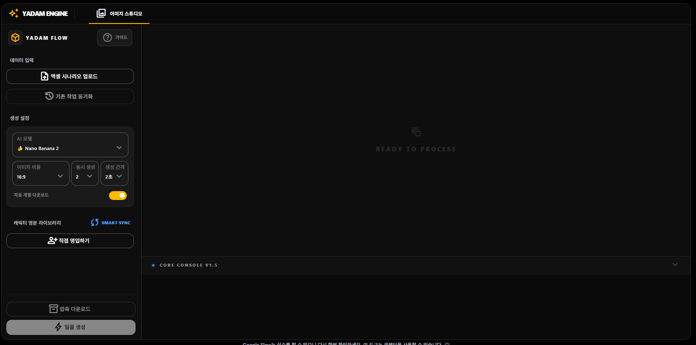
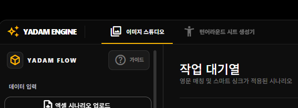
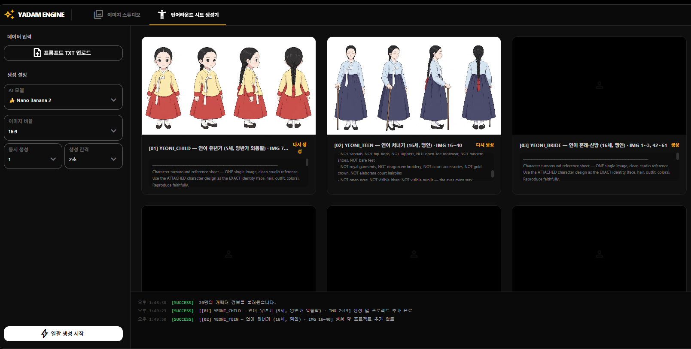
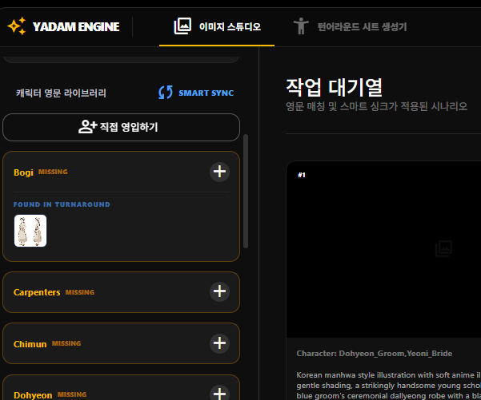

<p align="center">
  
</p>

<h1 align="center">YADAM ENGINE</h1>

<p align="center">
  <b>야담 콘텐츠 제작을 위한 AI 이미지 자동화 도구</b><br/>
  엑셀 시나리오 기반 캐릭터 턴어라운드 시트 생성 & 이미지 스튜디오 일괄 생성
</p>

---

## 목차

1. [시작하기](#1-시작하기--초기-화면)
2. [엑셀 시나리오 업로드](#2-엑셀-시나리오-업로드)
3. [턴어라운드 시트 생성](#3-턴어라운드-시트-생성)
4. [스마트 싱크 & 캐릭터 매칭](#4-스마트-싱크--캐릭터-매칭)
5. [이미지 스튜디오 일괄 생성](#5-이미지-스튜디오-일괄-생성)

---

## 1. 시작하기 — 초기 화면

프로그램을 실행하면 **이미지 스튜디오** 탭이 기본으로 표시됩니다.



### 좌측 패널 구성

| 영역 | 설명 |
|------|------|
| **데이터 입력** | 엑셀 시나리오 업로드 / 기존 작업 동기화 |
| **생성 설정** | AI 모델, 이미지 비율, 동시 생성 수, 생성 간격 설정 |
| **자동 개별 다운로드** | 생성된 이미지를 자동으로 개별 저장 (토글 ON/OFF) |
| **캐릭터 영문 라이브러리** | 캐릭터별 영문 프롬프트 관리 |
| **SMART SYNC** | 캐릭터 라이브러리를 시나리오에 매칭하여 적용 |

### 하단 버튼

- **압축 다운로드** — 생성된 이미지를 ZIP으로 일괄 다운로드
- **일괄 생성** — 업로드된 시나리오 기반으로 이미지 순차 생성

---

## 2. 엑셀 시나리오 업로드

**엑셀 시나리오 업로드** 버튼을 클릭하여 준비된 `.xlsx` 파일을 업로드합니다.



업로드가 완료되면:

- 상단 탭에 **턴어라운드 시트 생성기** 탭이 자동으로 추가됩니다.
- 메인 영역에 **작업 대기열**이 표시되며, 영문 매칭 및 스마트 싱크가 적용된 시나리오 목록을 확인할 수 있습니다.

> **다음 단계:** 턴어라운드 시트 생성기 탭을 클릭하여 캐릭터 턴어라운드 이미지를 먼저 생성합니다.

---

## 3. 턴어라운드 시트 생성

**턴어라운드 시트 생성기** 탭으로 이동합니다.



### 사용 방법

1. **프롬프트 TXT 업로드** 버튼을 클릭하여 캐릭터별 프롬프트가 담긴 `.txt` 파일을 업로드합니다.
2. 좌측에서 **AI 모델**, **이미지 비율**, **동시 생성 수**, **생성 간격**을 설정합니다.
3. 하단의 **일괄 생성 시작** 버튼을 클릭합니다.

### 생성 결과

- 각 캐릭터별로 다양한 각도의 턴어라운드 이미지가 자동 생성됩니다.
- 카드에는 캐릭터 이름, 나이, 의상 정보와 함께 프롬프트 내용이 표시됩니다.
- 하단 로그에서 생성 진행 상황을 실시간으로 확인할 수 있습니다.
- 각 카드의 **다시 생성** 버튼으로 개별 재생성이 가능합니다.

> **자동 전달:** 생성이 완료된 턴어라운드 이미지는 자동으로 **이미지 스튜디오**의 캐릭터 라이브러리에 등록됩니다.

---

## 4. 스마트 싱크 & 캐릭터 매칭

이미지 스튜디오 탭으로 돌아와 **SMART SYNC** 버튼을 클릭합니다.



### 캐릭터 영문 라이브러리

- 시나리오에 등장하는 캐릭터 목록이 표시됩니다.
- 각 캐릭터의 상태를 확인할 수 있습니다:
  - 🟡 **MISSING** — 영문 프롬프트가 아직 매칭되지 않음
  - **FOUND IN TURNAROUND** — 턴어라운드 시트에서 자동 발견됨
- **직접 영입하기** 버튼으로 수동으로 캐릭터를 추가할 수도 있습니다.

### SMART SYNC 적용

> **중요:** SMART SYNC 버튼을 눌러야 캐릭터 라이브러리의 영문 프롬프트가 이미지 생성 시 실제로 적용됩니다. 싱크하지 않으면 캐릭터 정보 없이 생성됩니다.

---

## 5. 이미지 스튜디오 일괄 생성

스마트 싱크 완료 후, 이미지 스튜디오에서 최종 이미지를 생성합니다.

### 생성 전 확인사항

- [x] 엑셀 시나리오가 업로드되어 작업 대기열에 표시되는지 확인
- [x] 턴어라운드 이미지가 생성되었는지 확인
- [x] SMART SYNC를 실행하여 캐릭터 매칭이 적용되었는지 확인
- [x] AI 모델, 이미지 비율 등 생성 설정이 원하는 값인지 확인

### 생성 실행

하단의 **일괄 생성** 버튼을 클릭하면 작업 대기열의 시나리오가 순차적으로 처리되며, 각 장면에 맞는 야담용 이미지가 자동 생성됩니다.

---

## 전체 워크플로우 요약

```
엑셀 시나리오 업로드
        │
        ▼
턴어라운드 시트 생성기 탭 활성화
        │
        ▼
프롬프트 TXT 업로드 → 일괄 생성 시작
        │
        ▼
캐릭터 턴어라운드 이미지 자동 생성
        │
        ▼
이미지 스튜디오로 자동 전달
        │
        ▼
SMART SYNC 실행 (캐릭터 매칭 적용)
        │
        ▼
일괄 생성 → 야담용 이미지 완성
```

---

<p align="center">
  
  <br/>
  <sub>YADAM ENGINE &copy; 2026 — CORE CONSOLE V1.5</sub>
</p>
